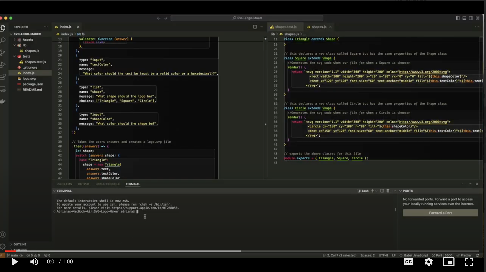

# SVG Generator

### User Story

```md
AS a freelance web developer
I WANT to generate a simple logo for my projects
SO THAT I don't have to pay a graphic designer
```

## Acceptance Criteria

```md
GIVEN a command-line application that accepts user input
WHEN I am prompted for text
THEN I can enter up to three characters
WHEN I am prompted for the text color
THEN I can enter a color keyword (OR a hexadecimal number)
WHEN I am prompted for a shape
THEN I am presented with a list of shapes to choose from: circle, triangle, and square
WHEN I am prompted for the shape's color
THEN I can enter a color keyword (OR a hexadecimal number)
WHEN I have entered input for all the prompts
THEN an SVG file is created named `logo.svg`
AND the output text "Generated logo.svg" is printed in the command line
WHEN I open the `logo.svg` file in a browser
THEN I am shown a 300x200 pixel image that matches the criteria I entered
```

## Table of Contents

- [Installation](#installation)
- [Usage](#usage)
- [Credits](#credits)
- [License](#license)

## Installation

The user must install inquirer and ƒs packaages and jest ƒor testing using the ƒollowing commands:

```bash
npm i
```

```bash
npm i ƒs
```

```bash
npm install --save-dev jest
```

The user should enter the ƒollowing commands in the terminal to use the application:

```bash
npm start
```

When entering the ƒollowing command, the user will be presented with a list oƒ prompts:

```bash
node index.js
```

## Usage

As a freelance web developer, you can use this command-line application to generate a simple logo for your projects, avoiding the need to pay a graphic designer.

- Run the application.
- Enter text (up to three characters).
- Specify the text color (using a color keyword or hexadecimal number).
- Choose a shape from the list: circle, triangle, or square.
- Specify the shape's color (using a color keyword or hexadecimal number).
- After providing all inputs, an SVG file named logo.svg will be created.
- The command line will display the message "Generated logo.svg".
- Open the logo.svg file in a browser to view a 300x200 pixel image matching your criteria.

Prompts being asked.


Upon providing input, the application will dynamically generate a logo.svg file incorporating the user's responses. When accessed through a browser, the SVG image will render according to the specified parameters. Example below:


WALKTHROUGH VIDEO:

[](https://drive.google.com/file/d/1SsaIj1rGqODizgnWkav5QfEwuYkHr3YA/view?usp=drive_link)

## License

MIT License

## Tests

To run tests the user must end the ƒollowing commands:

```bash
npm test
```

and the terminal will prompt iƒ passed or ƒailed. It will look like the ƒollowing image iƒ passed.


---

© Adriana Nino. [Github Repo](https://github.com/ninadri/SVG-Logo-Maker).
